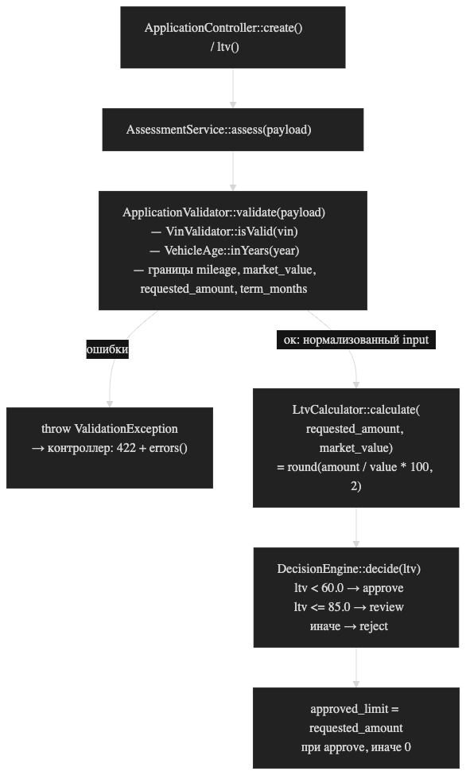

# Карта кода: как считается решение approve / review / reject

Ответ на вопрос «как по заявке получается решение» по `backend/src/Domain/`
и `backend/config/rules.php`. Все числа — учебные, из `rules.php`.

## Цепочка «файл → функция → порядок»

| # | Файл | Функция | Что делает |
|---|------|---------|------------|
| 1 | `backend/src/AppFactory.php` | `create()` | `require backend/config/rules.php`, собирает объекты: `VinValidator($rules['vin'])`, `VehicleAge((int) date('Y'))`, `ApplicationValidator($rules, …)`, `LtvCalculator`, `DecisionEngine($rules['ltv'])`, `AssessmentService` |
| 2 | `backend/src/Http/ApplicationController.php` | `create()` / `ltv()` | точка входа (POST `/api/applications`, POST `/api/ltv`), вызывает `AssessmentService::assess($payload)` |
| 3 | `backend/src/Domain/AssessmentService.php` | `assess()` | оркестратор: валидация → LTV → решение → ответ |
| 3.1 | `backend/src/Domain/ApplicationValidator.php` | `validate()` | нормализует заявку или бросает `ValidationException` (→ HTTP 422 `{"errors": …}`, решение не считается) |
| 3.1a | `backend/src/Domain/VinValidator.php` | `isValid()` | VIN: длина 17, `A-Z0-9`, без `I`, `O`, `Q` |
| 3.1b | `backend/src/Domain/VehicleAge.php` | `inYears()` | возраст авто = текущий год − год выпуска |
| 3.2 | `backend/src/Domain/LtvCalculator.php` | `calculate()` | `round(requested_amount / market_value * 100, 2)` |
| 3.3 | `backend/src/Domain/DecisionEngine.php` | `decide()` | решение по LTV: единственное место, где рождается approve/review/reject |
| 4 | `backend/src/Repository/ApplicationRepository.php` | `save()` | только для POST `/api/applications`: заявка и решение пишутся в MySQL |

Что именно проверяет `validate()` (`backend/src/Domain/ApplicationValidator.php:24`):

- `vin` — формат (делегирует `VinValidator`);
- `year` — не раньше `vehicle.min_year` (1990), не в будущем, не старше
  `vehicle.max_age_years` (20) — возраст через `VehicleAge`;
- `mileage` — от 0 до `vehicle.max_mileage_km` (500 000);
- `market_value` — больше 0;
- `requested_amount` — от `amount.min` (50 000) до `amount.max` (2 000 000);
- `term_months` — от `term.min_months` (3) до `term.max_months` (48).

Решение в `DecisionEngine::decide()` (`backend/src/Domain/DecisionEngine.php:30`)
по порогам `ltv.approve_max = 60.0` и `ltv.review_max = 85.0`:

```
LTV <  60.0  -> approve
LTV <= 85.0  -> review
LTV >  85.0  -> reject
```

Граница: в коде строгое `<`, поэтому LTV ровно 60.0 → `review`.
В комментариях `rules.php` и `DecisionEngine` написано «LTV <= approve_max -> approve» —
расхождение комментария с кодом.

Ответ `assess()`: `vehicle_age`, `ltv`, `decision`, `approved_limit`
(= запрошенная сумма при `approve`, иначе 0) и нормализованный `input`.
Справочник `ltv_by_age` в `rules.php` заполнен, но никем не используется —
лимит по возрасту не считается (задача LOAN-12, комментарий в `rules.php:48`).

## Точка вставки правила «пробег не больше 400 000 км, иначе review»

Правило меняет **решение**, значит место — `DecisionEngine::decide()`
и место его вызова `AssessmentService::assess()` (`backend/src/Domain/AssessmentService.php:33`,
`$decision = $this->decisionEngine->decide($ltv);`).

1. Порог 400 000 км — новое бизнес-число, по конвенции AGENTS.md идёт в
   `backend/config/rules.php`. Существующий ключ `vehicle.max_mileage_km = 500000` —
   это **другое**: граница валидации (за ней 422), а не порог решения.
2. В `DecisionEngine::decide()` сигнатура сейчас `decide(float $ltv): string` —
   пробег туда не поступает. Нужно добавить параметр (`decide(float $ltv, int $mileage)`)
   и после вычисления решения по LTV понижать `approve` до `review` при пробеге выше порога.
   Порог прокинуть через конструктор — так же, как `approve_max` / `review_max`.
3. В месте вызова передать `$input['mileage']`.

Приоритет двух факторов в коде **не определён**: механизма комбинирования
LTV-решения с другими признаками нет. Что делать при LTV = `reject` + перепробег
или LTV = `review` + перепробег — надо задать в спеке (вариант «пробег только
понижает approve до review, остальные решения не трогает» — предположение,
в коде его нет).

Что для правила уже есть:

- `mileage` парсится и валидируется в `ApplicationValidator::validate()`
  и возвращается в `$input['mileage']` как int (`backend/src/Domain/ApplicationValidator.php:43-46,78`);
- `$input` уже доступен в `assess()` в точке вызова `decide()`;
- константа `DecisionEngine::REVIEW` есть;
- `rules.php` загружается в `AppFactory::create()`, массив порогов уже передаётся
  в конструктор `DecisionEngine`.

Чего не хватает:

- параметра `mileage` в `DecisionEngine::decide()`;
- ключа с порогом 400 000 в `rules.php` (такого ключа нет, есть только `max_mileage_km`);
- логики комбинирования/приоритета двух критериев решения;
- обновления `tests/Unit/DecisionEngineTest.php` — вызывает `decide($ltv)` с одним аргументом;
- PHPDoc конструктора `DecisionEngine` (`array{approve_max:float,review_max:float}`)
  не описывает новый ключ.

## Что в коде уже сейчас проверяется про пробег

- `ApplicationValidator::validate()` (`backend/src/Domain/ApplicationValidator.php:43-46`):
  `(int)($payload['mileage'] ?? -1)`; если меньше 0 или больше
  `vehicle.max_mileage_km` (500 000) — ошибка «Пробег от 0 до 500000 км» →
  `ValidationException` → HTTP 422. Отсутствующее поле тоже даёт ошибку
  (значение по умолчанию −1). То есть заявка с пробегом вне [0; 500 000]
  до расчёта решения вообще не доходит.
- Пробег сохраняется в БД: `ApplicationRepository::save()` пишет `vehicles.mileage_km`
  (`backend/src/Repository/ApplicationRepository.php:38-45`), читается в `find()` / `listApplications()`.
- В самом решении пробег не участвует: `LtvCalculator`, `DecisionEngine` и
  `AssessmentService::assess()` его не читают — нет.
- Других проверок пробега нет. Числа 400 000 в коде и конфиге нет.


--- 

### Диаграмма

